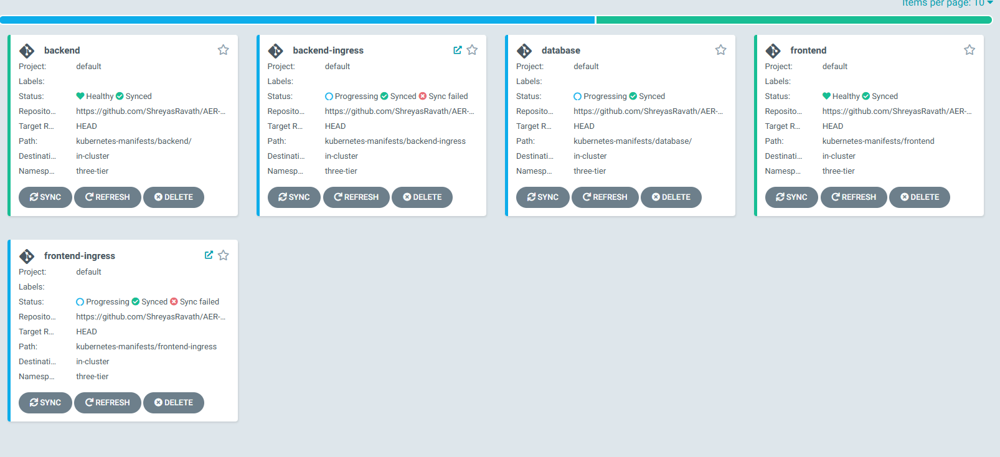

#Steps to check the project

#Step 1 : Login to cloudshell of the account. 

run following commands to ensure terraform is installed on cloudshell
```
git clone https://github.com/tfutils/tfenv.git ~/.tfenv

mkdir ~/bin

ln -s ~/.tfenv/bin/* ~/bin/

tfenv install

tfenv use 1.4.4

terraform --version

```

#Step 2 : clone the Repo
```
git clone https://github.com/ShreyasRavath/AER-DevOpsPipeline
```

#Step 3: Create Jenkins Server
```
cd AER-DevOpsPipeline/jenkins-server-terraform/
terraform init
aws ec2 describe-key-pairs --key-names devsecops-project >/dev/null 2>&1 && aws ec2 delete-key-pair --key-name devsecops-project && rm -f devsecops-project.pem; aws ec2 create-key-pair --key-name devsecops-project --query "KeyMaterial" --output text > devsecops-project.pem && chmod 400 devsecops-project.pem
terraform apply --auto-approve
```


#Step 4 : Connect to Jenkins Server
Copy the follwoing code to get the initial password string and change the password 

```
sudo cat /var/lib/jenkins/secrets/initialAdminPassword
```

Access the Jenkins server using the <public IP> :8080 and use the copied password --> Install suggested plugins 
Once done create first admin user --> Save an finish

#Step 5: Login with the new user created and go to Manage Jenkins and install following available plugins
```
AWS Credentials
AWS #Steps
Docker plugins
Eclipse Temurin installer
NodeJS
OWASP Dependency-Check,
SonarQube Scanner.
```

#Step 6: Configure the sonar qube server
###note: since we are keeping the system in stopped state. We need to start the sonarqube container before accessing. run "docker start sonar" on Jenkins Server
Access the Sonarqube server using the <public IP> :9090
Create two projects one for frontend and one for backend (Copy the token of projects to use during pipeline)
Create a webhook mentioning the jenkins url with URI 

#Step 7: Create ECR repositories, execute following commands in cloudshell to create repos
```
aws ecr create-repository --repository-name front-end
aws ecr create-repository --repository-name front-end
```
Get any of the push commands and execute it on jenkins server to ensure ecr is accessible. 

#Step 8: Configure Jenkins
Set up all the credentials under system-> credentials to safely store all critical tokens and passwords


#Step 9 : Configure plugins
Set up all plugins installed JDK, Sonar-scanner, nodejs, DP-Check and docker
Note: all latest and install automatically is used.

#Step 10: Create EKS Cluster. Execute following command 
```
 eksctl create cluster --name three-tier-k8s-eks-cluster --region us-east-1 --node-type t2.medium --nodes-min 2 --nodes-max 2

 ###create LoadBalancer for ingress controller
 ```
 curl -O https://raw.githubusercontent.com/kubernetes-sigs/aws-load-balancer-controller/v2.5.4/docs/install/iam_policy.json
 aws iam create-policy --policy-name AWSLoadBalancerControllerIAMPolicy --policy-document file://iam_policy.json
 eksctl utils associate-iam-oidc-provider --region=us-east-1 --cluster=three-tier-k8s-eks-cluster --approve
eksctl create iamserviceaccount --cluster=three-tier-k8s-eks-cluster --namespace=kube-system --name=aws-load-balancer-controller --role-name AmazonEKSLoadBalancerControllerRole --attach-policy-arn=arn:aws:iam::381751878913:policy/AWSLoadBalancerControllerIAMPolicy --approve --region=us-east-1
 ```

#Step10: Create AWS Load Balancer controller
```
helm repo add eks https://aws.github.io/eks-charts
helm repo update eks
helm install aws-load-balancer-controller eks/aws-load-balancer-controller -n kube-system --set clusterName=three-tier-k8s-eks-cluster --set serviceAccount.create=false --set serviceAccount.name=aws-load-balancer-controller
```
###Note: use following command to check the LB controller deployment. 
kubectl get deployment -n kube-system aws-load-balancer-controller

#Step11: configure grafana and prometheus
Execute following commands. 
```
helm repo add stable https://charts.helm.sh/stable
helm repo add prometheus-community https://prometheus-community.github.io/helm-charts
kubectl create namespace monitoring
helm install stable prometheus-community/kube-prometheus-stack -n monitoring
kubectl get pods -n monitoring
kubectl get svc -n monitoring
```

#Step12: set grafana and prometheus to use LoadBalancer instead of clusterIP
###edit the below files and set 
```
kubectl edit svc stable-kube-prometheus-sta-prometheus -n monitoring
kubectl edit svc stable-kube-prometheus-sta-prometheus -n monitoring
```


#Step13: configure grafana and prometheus
Login to grafana and create prometheus datasource and set the dashboard to use the new datasource

#Step14: create jenkins pipeline
Create two pipeline
1. frontend : copy the code from https://github.com/ShreyasRavath/AER-DevOpsPipeline.git repo jenkins-pipeline-->jenkinsfile-frontend
2. backend : copy the code from https://github.com/ShreyasRavath/AER-DevOpsPipeline.git repo jenkins-pipeline-->jenkinsfile-backend


#Step15: Install ArgoCD for deployment automation
execute following commands on the jenkins server
```
kubectl create namespace three-tier
kubectl create secret generic ecr-registry-secret \
  --from-file=.dockerconfigjson=${HOME}/.docker/config.json \
  --type=kubernetes.io/dockerconfigjson --namespace three-tier
kubectl get secrets -n three-tier
kubectl create namespace argocd
kubectl apply -n argocd -f https://raw.githubusercontent.com/argoproj/argo-cd/v2.4.7/manifests/install.yaml
###after above command, check whether all pods are running or not
kubectl get pods -n argocd
###Now lets expose the argocd app
kubectl patch svc argocd-server -n argocd -p '{"spec": {"type": "LoadBalancer"}}'
```

#Step 16: Get ArgoCD Server Details. 
```
###To get LB details and password execute below command
sudo apt install jq -y
export ARGOCD_SERVER=$(kubectl get svc argocd-server -n argocd -o json | jq -r '.status.loadBalancer.ingress[0].hostname') && export ARGO_PWD=$(kubectl -n argocd get secret argocd-initial-admin-secret -o jsonpath="{.data.password}" | base64 -d) && echo "ARGOCD_SERVER: $ARGOCD_SERVER" && echo "ARGO_PWD: $ARGO_PWD"
```

#Step 17:
Logon to the argocd application using the password obtained in last #Step with admin as username. 
We need to configure five application to be configured. Create newapp and set following path within repo to register five apps. 
frontend --> <repo>/kubernetes-manifests/frontend
backend --> <repo>/kubernetes-manifests/backend
database --> <repo>/kubernetes-manifests/database
frontend-ingress --> <repo>/kubernetes-manifests/frontend-ingress
backend-ingress --> <repo>/kubernetes-manifests/backend-ingress



#Step 18: 
Once done. All five apps will be visible as synced and we can validate the pod deployment on our cluster using following command
```
kubectl get pods -n three-tier
```


Deletion #Steps: 
###first we need to delete the cluster 
eksctl delete cluster --name three-tier-k8s-eks-cluster --region us-east-1 --wait --timeout 30m
###wait for cluster to get deleted. 

Once the cluster is deleted, we need to delete jenkins servers. execute following command on cloudshell

```
cd AER-DevOpsPipeline/jenkins-server-terraform/
terraform destroy
```
###approve the destruction. 

Thanks Jesse for wonderful training!!!


